# Introudction
This the MIPI camera software SDK for Raspberry pi platform, which allow you connect global shutter cameras and upto 18MP cameras on RPI board.

Now the supported MIPI camera modules are below:

* 0.3MP OV7251 Monochrome Global Shutter
 
* 1MP OV9281 Monochrome Global Shutter
 
* 2MP OV2311 Monochrome Global Shutter

* 13MP IMX135 Color Rolling Shutter

* 16MP IMX298 Color Rolling Shutter

* 18MP AR1820 Color Rolling Shutter

# Video Demo
[](https://youtu.be/XJ2VrwXMhy4 "Up to 18MP MIPI Cameras for Raspberry Pi")       
# Prerequisites
## Enable the camera
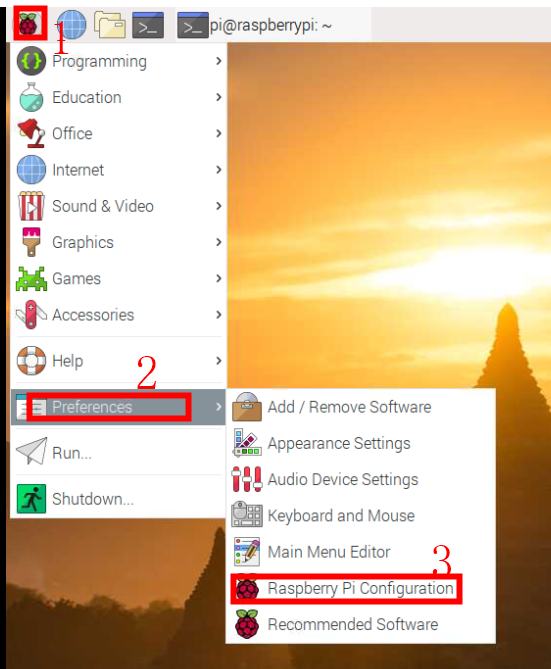
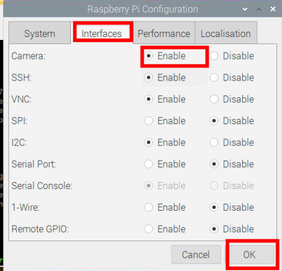

## Install support package
`sudo apt-get update && sudo apt-get install libzbar-dev libopencv-dev`

`sudo apt-get install python-opencv`

## Download and install the SDK library
```bash
$ pi@raspberrypi:~ $ git clone https://github.com/ArduCAM/MIPI_Camera.git
```

```bash
pi@raspberrypi:~ $ cd MIPI_Camera/RPI/
```

```bash
pi@raspberrypi:~/MIPI_Camera/RPI $ make install 
```

```bash
pi@raspberrypi:~/MIPI_Camera/RPI $ chmod +x enable_i2c_vc.sh 
```
```bash
pi@raspberrypi:~/MIPI_Camera/RPI $ ./enable_i2c_vc.sh
```

Then click Y/y to reboot now

## Compile the Examples
```bash
pi@raspberrypi:~ $ cd MIPI_Camera/RPI/
```
```bash
pi@raspberrypi:~/MIPI_Camera/RPI $ make clean && make 
```
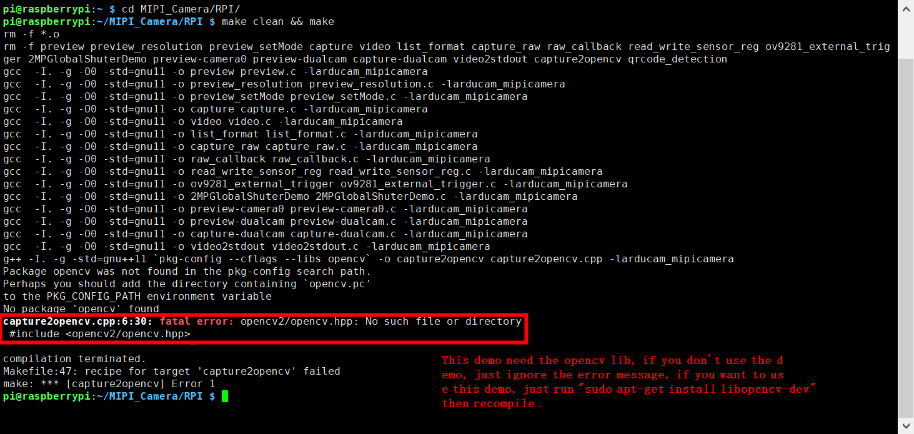
## How to use the detail demo? (use the ov9281 as an example)
- arducamstill
This demo is used to how to run the Arducam mipi camera 
```bash
pi@raspberrypi:~/MIPI_Camera/RPI $ ./arducamstill -? 
```
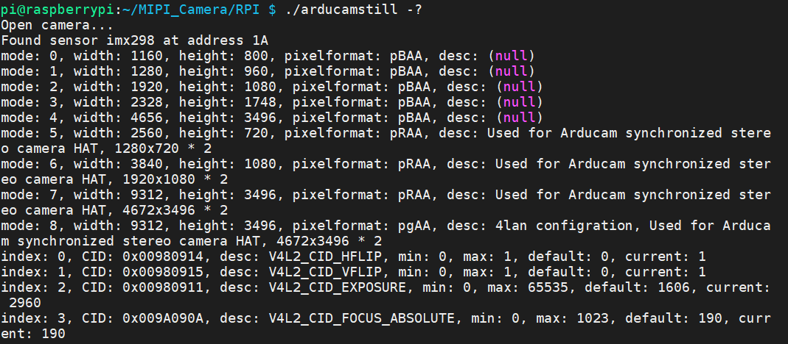
```bash
pi@raspberrypi:~/MIPI_Camera/RPI $ ./arducamstill -t 0 -m 1 -awb 1 -ae 1
```


- list_format
This demo is used to check all resolution the sensor you are using supports
```bash
pi@raspberrypi:~/MIPI_Camera/RPI $ ./list_format 
```


- preview_setMode
This demo is used to preview with the mode we set.
```bash
pi@raspberrypi:~/MIPI_Camera/RPI $ ./preview_setMode
```

If I choose mode 0 run the command to run our camera
```bash
pi@raspberrypi:~/MIPI_Camera/RPI $ ./preview_setMode 0
```

If anything is normal, you will see the preiew image shown as the below image
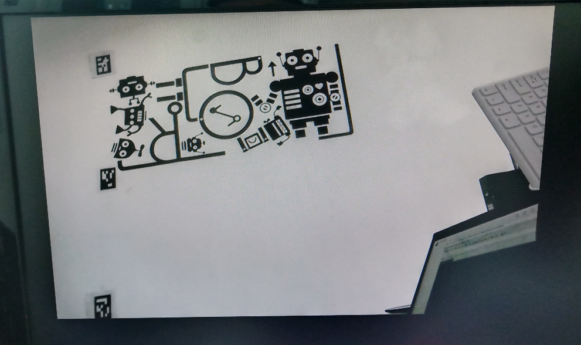
- capture
This demo is used to capture one frame image with the special encoder format we set .
```bash
pi@raspberrypi:~/MIPI_Camera/RPI $ ./capture
```

If I choose mode 0

The default encoder is jpeg, if you want to change others, just opne the capture.c file 
and change here:

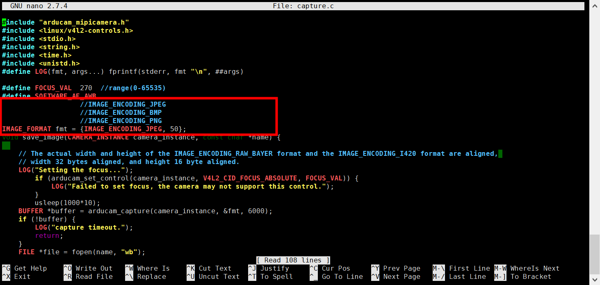

Notice: if you want to get the image with BMP or PNG encoder, you shuold set the encoder time to more. I advise you set 12000 in the capture.c file.
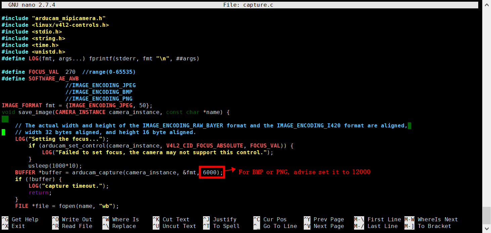

## How to use Arducam stereo hat? (use the ov9281 as an example)
- Hardware setup
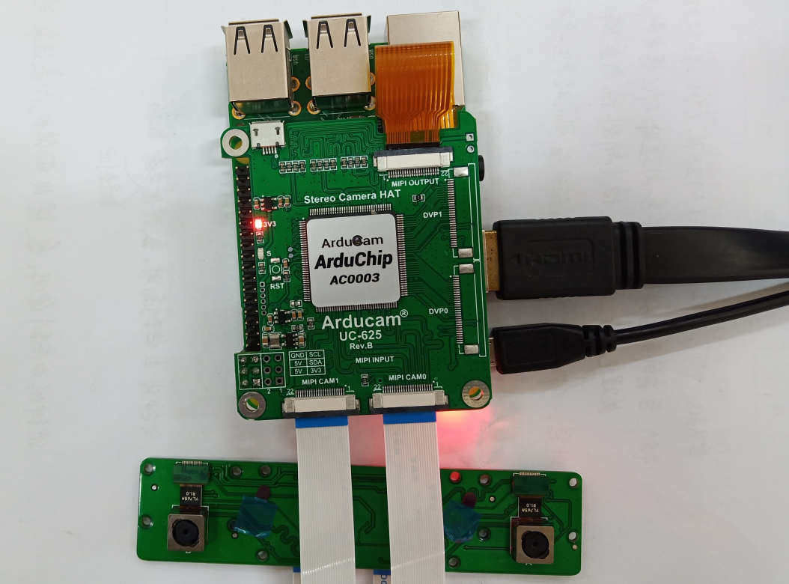
- Run the ./list_format to check which mode is used for stereo hat.
```bash
pi@raspberrypi:~/MIPI_Camera/RPI $ ./list_format 
```
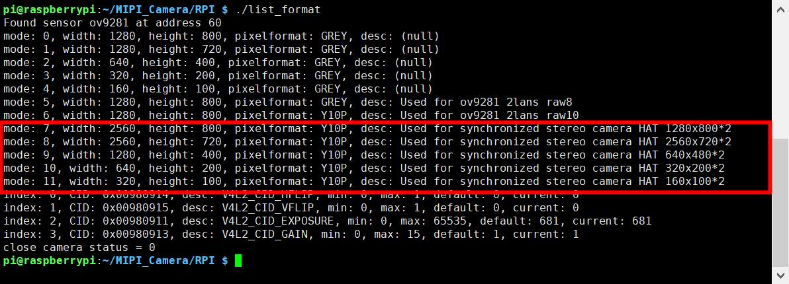
From the print message, we can see the mode 7-11 ared used for stereo hat. I choose the mode7 as a demo
```bash
pi@raspberrypi:~/MIPI_Camera/RPI $ ./preview_setMode 7
```


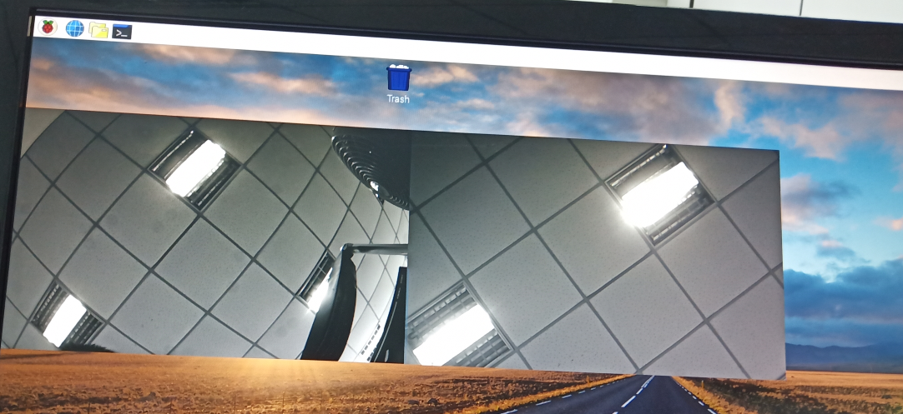


## Optional Settings
Edit /boot/config.txt file.
Find gpu_mem=xxx line
Modify gpu_mem size with proper size, recommend to use 

`gpu_mem=160` for 13MP  camera board,

`gpu_mem=180` for 16MP or higher camera board.

# Running the Examples
## preview_setMode Example 
```bash
$ ./preview_setMode [mode]
```
In the preview_setMode example, it will demo how to do preview the Specified mode listed from ./list_format command.

## Capture Example
```bash
$ ./capture [mode]
```
In the capture.c example, it will capture diffferent resolution in with different encoder, support JPEG BMP PNG.

```bash
$ ./capture_raw
```
In the capture_raw.c example, it will capture diffferent resolution none interpolation raw format images, especially useful for monochrome sensors.

```bash
$ ./raw_callback
```
In the raw_callback.c example, it is callback version of capture_raw example.

## Video Recording Example
```bash
$ ./video
```
In the video.c example, it will record the video in H246 format.

## Camera Control Query Example
```bash
$ ./list_format
```
In the list_format.c example, it will list camera supported resolution and control functions.

## Sensor Register Read/Write Example
```bash
$ ./read_write_sensor_reg
```
In the read_write_sensor_reg.c example, it illustrates how to directly read/write sensor registers.
This example might need to be modifed according to the correct sensor register address.

## OpenCV Example
```bash
$ ./capture2opencv
```
In the capture2opencv.cpp example, it converts YUV data to OpenCV Mat format, and displays as is.

## Gstreamer Example
In the video2stdout.c example, it outputs H.264 video stream to stdout, and uses gstreamer to push the stream to PC.

### Example 1:

Raspberry pi side command:
```bash
$ ./video2stdout | nc -l -p 5000
```
PC side command: (x.x.x.x is your Raspberry Pi IP address)
```bash
$  gst-launch-1.0  -v tcpclientsrc  host=x.x.x.x  port=5000 ! decodebin ! autovideosink
```

### Example 2:

Raspberry pi side command:  (x.x.x.x is your Raspberry Pi IP address)
```bash
$ ./video2stdout | gst-launch-1.0 -v fdsrc ! h264parse !  rtph264pay config-interval=1 pt=96 ! gdppay ! tcpserversink host=x.x.x.x port=5000
```
PC side command: (x.x.x.x is your Raspberry Pi IP address)
```bash
$  gst-launch-1.0 -v tcpclientsrc host=x.x.x.x port=5000 ! gdpdepay ! rtph264depay ! avdec_h264 ! autovideosink sync=false
```

## QR Code Detection Example
```bash
$ ./qrcode_detection <exposure_value>
```
In the qrcode_detection.cpp example, it illustrates how to use global shutter camera like OV7251 or OV9281 to detect QR code using OpenCV.
To run this demo you have to install the dependence 

`sudo apt-get update && sudo apt-get install libzbar-dev libopencv-dev`

## Dual Camera Demo
```bash
$ ./preview-dualcam
or
$ ./capture-dualcam
```
In the preview-dualcam.c examle, it illustrates how to open the two camera ports on Raspberry pi compute module at the same time for preview.
And the capture-dualcam.c examle, it illustrates how to do capture from each camera port on Raspberry pi compute module by switching between them.

A camera_interface struct should be constructed according to your hardware wiring.

For example camera port 0 is using sda_pin 28, scl_pin 29, led_pin 30, shutdown_pin 31, and camera port 1 is using sda_pin 0, scl_pin 1, led_pin 2, shutdown_pin 3.

More information about the compute module wiring please check : https://www.raspberrypi.org/documentation/hardware/computemodule/cmio-camera.md 

## OV9281 External Trigger Demo
In the ov9281_external_trigger.c example, you can see how to synchronize the camera to the external trigger events.

# Python Wrapper and Examples
The arducam_mipicamera.py script is a wrapper for the libarducam_mipicamera.so dynamic library. 
To use this script you need to pre-install libarducam_mipicamera.so.
All python examples are in the Python Folder.

## Dependency
`sudo pip install v4l2`

`sudo pip install numpy`

`sudo apt-get install python-opencv`

# Utility
## How to playback the H264 file
1. Compile hello_video.bin
```bash
$ cd /opt/vc/src/hello_pi && ./rebuild.sh
```

2. Play H264 file
```bash
$ /opt/vc/src/hello_pi/hello_video/hello_video.bin test.h264
```

## How to view RAW data
In the utils folder, there are two python script to read and display RAW image.

`mipi_raw10_to_jpg.py` is used to display color RAW image.

`mono_to_jpg.py` is used to display monochrome RAW iamge.

# Trouble shooting        
## Error message open camera status = -1
Didn't enable the camera, see Prerequisites->Enable the camera.

Didn't enable i2c_vc, see Prerequisites->Enable i2c_vc.

Camera cable loose.

Run the script camera_i2c from utils folder and send output message to support@arducam.com

`sudo chmod +x camera_i2c rpi3-gpiovirtbuf`  

`./camera_i2c`


You should set the gpu_mem to bigger. Open the config.txt file. Then reboot
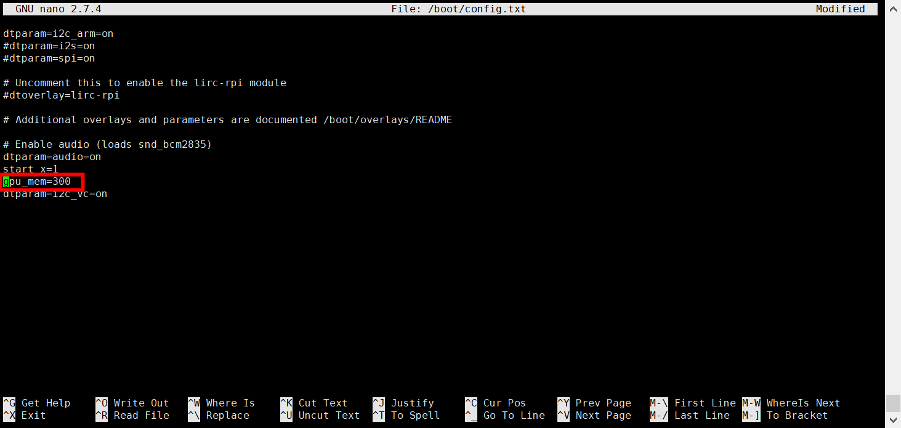

